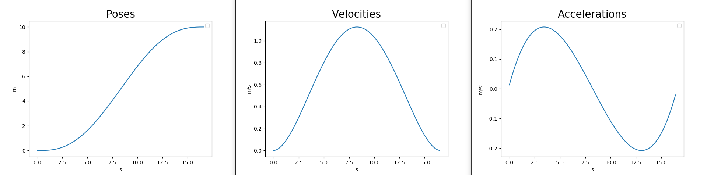

# Minimum jerk relative move

## Description

Translate or rotate the robot with a smooth acceleration.

### Library Description

The `minimum_jerk_trajectory_planner` repository contains the implementation of the library. 

The following classes are used to generate a trajectory:
- `Acceleration` contains the parameters of an acceleration vector (`x`, `y`, `theta`)
- `Velocity` contains the parameters of an velocity vector (`x`, `y`, `theta`)
- `Pose` contains the parameters of an pose vector (`x`, `y`, `theta`)
- `Trajectory` compute the acceleration and the velocities (`accelerations`, `velocities`) from a `timestamps` vector and a `poses` vector
- `TrajectoryPlanner`:
* the constructor take `total_time` which is the duration of the action and `dt` which is the interval between each intermediate *pose*, *velocity*, *acceleration*
* the function `generate_trajectory` compute `list_timestamps` vector and a `list_poses` vector from a **start pose** and a **target pose**
- `Robot`:
* the constructor take a `ǹame`, the `total_time` which is the duration of the action, a reference to a *TrajectoryPlanner* `path_finder_controller`, the start pose `pose_start`, the target pose `pose_target` and the `move_type` (*"r"* or *"tx"* or *"ty"*)
* the function `generate_trajectory`compute the Trajectory `odometry` with the *TrajectoryPlanner* `path_finder_controller`

All parameters of all classes are accessible with getters.

### Rotate Action 

```
#goal definition
float32 target_yaw
float32 min_velocity
bool enable_collision_check
float32 yaw_goal_tolerance
bool enable_data_save
---
#result definition
builtin_interfaces/Duration total_elapsed_time
---
float32 angular_distance_traveled
```

### Translate Action

```
#goal definition
float32 target_x
float32 min_velocity
bool enable_collision_check
float32 xy_goal_tolerance
bool enable_data_save
---
#result definition
builtin_interfaces/Duration total_elapsed_time
---
float32 distance_traveled
```

### Evolution in time 



### Minimum Jerk Relative Move

- Launch the minimum jerk lifecycle node: `ros2 launch minimum_jerk_ros minimum_jerk_launch.py`
- Request rotation: `ros2 action send_goal /rotate minimum_jerk_msgs/action/Rotate "{target_yaw: 2.7, min_velocity: 1, enable_collision_check: true, yaw_goal_tolerance: 0.1, enable_data_save: false}" --feedback`
- Robot should be rotating by 2.7 rad.
- Request translation: `ros2 action send_goal /translate minimum_jerk_msgs/action/Translate "{target_x: 2, min_velocity: 0.2, enable_collision_check: true, xy_goal_tolerance: 0.01, enable_data_save: false}" --feedback`
- Robot should be translating by 2 m.

### Documentation About Minimum Jerk Trajectory

See this documentation [online](https://mika-s.github.io/python/control-theory/trajectory-generation/2017/12/06/trajectory-generation-with-a-minimum-jerk-trajectory.html)


